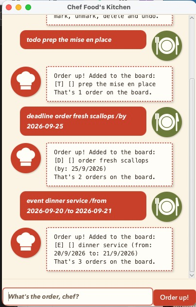

# Chef Food User Guide



**Chef Food** is a desktop task manager that runs your to-do list like a kitchen.
You type an order, Chef Food pins it to the board, and you plate it when it's done.
Because you type instead of click, you can get a task down in a second and get back to work.

## Getting started

1. Make sure you have **Java 25** installed.
2. Download `food.jar` and put it in a folder of its own — Chef Food saves your tasks next to it, in `data/tasks.md`.
3. Open a terminal in that folder and run:

   ```
   java -jar food.jar
   ```

4. Type an order in the box at the bottom and press **Enter** (or click **Order up!**).

Your board is saved automatically after every change, so you can close the window whenever you like.

## Adding tasks

Chef Food takes three kinds of order.

### A plain task: `todo`

For something with no date attached.

Format: `todo <description>`

Example: `todo prep the mise en place`

```
Order up! Added to the board:
[T] [] prep the mise en place
That's 1 order on the board.
```

### A task with a due date: `deadline`

Format: `deadline <description> /by <yyyy-mm-dd>`

Example: `deadline order fresh scallops /by 2026-09-25`

```
Order up! Added to the board:
[D] [] order fresh scallops (by: 25/9/2026)
That's 2 orders on the board.
```

### A task that spans dates: `event`

Format: `event <description> /from <yyyy-mm-dd> /to <yyyy-mm-dd>`

Example: `event dinner service /from 2026-09-20 /to 2026-09-21`

```
Order up! Added to the board:
[E] [] dinner service (from: 20/9/2026 to: 21/9/2026)
That's 3 orders on the board.
```

> **Dates go in as `yyyy-mm-dd`** — Chef Food shows them back to you as `25/9/2026`.

## Seeing what's on the board: `list`

Shows every task, numbered. Those numbers are what you use in `mark`, `unmark` and `delete`.

Example: `list`

```
Here's everything on the board tonight:
1. [T] [] prep the mise en place
2. [D] [] order fresh scallops (by: 25/9/2026)
3. [E] [] dinner service (from: 20/9/2026 to: 21/9/2026)
```

Reading a line: `[T]` `[D]` `[E]` tell you the kind of task, and `[X]` means it's done.

## Marking a task done: `mark` / `unmark`

Format: `mark <number>` and `unmark <number>`

Example: `mark 1`

```
Plated and served! This order is done:
[T] [X] prep the mise en place
```

Changed your mind? `unmark 1` puts it back on the fire.

## Removing a task: `delete`

Format: `delete <number>`

Example: `delete 3`

```
86 that! Off the board it goes:
[E] [] dinner service (from: 20/9/2026 to: 21/9/2026)
That's 2 orders on the board.
```

## Searching: `find`

Shows every task whose description contains what you typed. Upper or lower case doesn't matter, and you can search for a phrase.

Format: `find <keyword>`

Example: `find scallops`

```
Here's what matches on the board:
1. [D] [] order fresh scallops (by: 25/9/2026)
```

The numbers here count the matches, not the positions on the full board — run `list` before you `mark` or `delete`.

## Taking it back: `undo`

Reverses your last change, whether that was an add, a delete, a mark or an unmark.

Example: `undo`

```
Sent back! The board now reads:
1. [T] [] prep the mise en place
2. [D] [] order fresh scallops (by: 25/9/2026)
3. [E] [] dinner service (from: 20/9/2026 to: 21/9/2026)
```

Only the most recent change can be undone — `undo` twice will not take you back two steps.

## Leaving: `LET ME OUT!`

Type `LET ME OUT!` — capitals and all — to close down.

```
Service is over. Go get some rest, chef!
```

## When Chef Food says no

Chef Food would rather refuse an order than get it wrong, so it will stop you if:

* the command isn't one it knows — `That's not on my menu, chef.`
* an event would end before it starts — `An event can't end before it starts, chef.`
* the same task is already on the board — `That order is already on the board, chef.`
* a date isn't real (there's no 30 February) or isn't written as `yyyy-mm-dd`
* you give `/by`, `/from` or `/to` twice in one order

Extra spaces are fine — `mark   1` and `  list  ` both work.

## Command summary

| Command | Format | Example |
|---|---|---|
| Add a plain task | `todo <description>` | `todo prep the mise en place` |
| Add a due date | `deadline <description> /by <yyyy-mm-dd>` | `deadline order scallops /by 2026-09-25` |
| Add an event | `event <description> /from <yyyy-mm-dd> /to <yyyy-mm-dd>` | `event service /from 2026-09-20 /to 2026-09-21` |
| List everything | `list` | `list` |
| Mark done | `mark <number>` | `mark 1` |
| Mark not done | `unmark <number>` | `unmark 1` |
| Delete | `delete <number>` | `delete 3` |
| Search | `find <keyword>` | `find scallops` |
| Undo last change | `undo` | `undo` |
| Exit | `LET ME OUT!` | `LET ME OUT!` |
